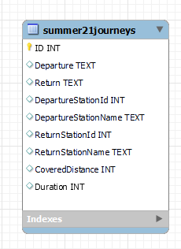
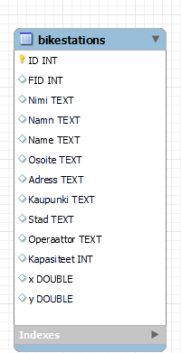

# Project: Helsinki-city-bike-app

Made by: Aapo Soukkio

***

## Purpose of this project

This is my solution for the pre-assignment for Solita Dev Academy Finland 2023

You can find the original assignment here --> https://github.com/solita/dev-academy-2023-exercise

## About the project 

This is a web application that displays data from journeys made with city bikes in the Helsinki Capital area.
The application allows users to view information about bike stations and journeys, including details such as departure
and return stations, distance, and duration.

The application is built using Blazor WebAssembly and consists of a frontend, backend and the necessary Entity Framework class librarys.
The backend uses a SQLite database to store journey and station data.

Users can view a list of all of the journeys made in 2021 summer, as well as detailed information about individual bike
stations,including the total number of journeys starting from or ending at the station, the average distance of
those journeys, and the top 5 most popular return and departure stations.

## Technologies Used

- C# and .NET Core 6 for the backend
- Blazor WebAssembly for the client
- Entity Framework Core for data access
- SQLite for the database

## About the data

The journey and station data used in this project is provided by City Bike Finland. There are three datasets of journey data, each covering
a month of the 2021 summer:

- https://dev.hsl.fi/citybikes/od-trips-2021/2021-05.csv
- https://dev.hsl.fi/citybikes/od-trips-2021/2021-06.csv
- https://dev.hsl.fi/citybikes/od-trips-2021/2021-07.csv

The dataset that provides information about Helsinki Region Transport’s (HSL) city bicycle stations is available at:

- https://opendata.arcgis.com/datasets/726277c507ef4914b0aec3cbcfcbfafc_0.csv

### Data processing/initialization

The provided CSV files were imported to a SQLite database using the DB Browser tool. All the journeys that lasted for
less than ten seconds or covered distances shorter than 10 meters were deleted from the database. A primary key column (ID)
was added to the journeys table, and an ID was generated for every journey using DB Browser generating tool.

### Database model 

The three datasets for the journeys made in summer 2021 were combined into a single table.

Bicycle stations dataset modelled to a database table.

## Features

The application provides the following features:

### Journeys List View

The journey list view allows the user to see all the journeys made with city bikes in Helsinki. Journeys are separated
by month, and each month has its own page. It's possible to search for journeys by date, and pagination is included to
avoid overloading the browser.

### Station List View

The Station List View page allows users to search for bike stations by name, and to view a paginated list of all bike
stations. The list displays the name and address of each bike station and a link to a Station Details and Stats page
for each station.

### Station Details View

The application displays detailed information about a single station, including the station name, address, total number
of journeys starting from the station, total number of journeys ending at the station, and the average distance of a journey
starting from or ending at the station. It is also possible to view the station location on the map and see the top 5 most
popular return and departure stations for journeys starting from or ending at the station. 

## How to run the project

To run the project, you need Visual Studio 2022 installed on your machine. You can download it [here](https://visualstudio.microsoft.com/vs/)

Here are the steps to run the project:

1. Clone the project from GitHub to your local machine. You can also copy the project straight to the Visual Studio 2022
by following these instructions https://learn.microsoft.com/en-us/visualstudio/get-started/tutorial-open-project-from-repo?view=vs-2022

2. Download the SQLite database file to your local machine from this link: https://drive.google.com/file/d/1TctURFUU7Dm6GDwttHhvJW19gUsrdcYU/view?usp=sharing

3. Copy the SQLite database file BikeApp.db under the Server folder. 

- Note: Do this BEFORE you run the project for the first time or otherwise the application will create a empty database and you will not be able see any data.
  Ofcource you can always delete the empty database (it's going to create it under Server folder) and copy the database provided at step 1. Or seed the 
  database however you want but it may affect the operation of the program.

4. Open the solution file Solita.HelsinkiBikeApp.sln in Visual Studio 2022.

5. Set the Solita.HelsinkiBikeApp.Server project as the startup project (if it's not by default).

6. Press F5 or click the 'Run' button to start the server and launch the application in your default web browser.
  The application will automatically open in your default browser using the HTTPS URL https://localhost:7293. 
  If you prefer to use the HTTP URL, you can manually type in the URL http://localhost:5293 in your browser.

- Note: The size of the database file is quite large and it may take some time to download. It is recommended to have a stable 
  internet connection while downloading the file. If you encounter problems when trying to load the database, please try
  with a different browser. Downloading the database has been tested successfully with Google Chrome and Microsoft Edge.
  It is still possible that due to your browser settings, loading the database will cause difficulties. In this case, I ask you to contact
  me immediately and I will deliver the database to you by another route. My contact information can be found under my Github profile.

## Tests

This project includes unit tests for the backend-side code. The tests use the NUnit testing framework.

### How to run the tests

To run the tests, follow these steps:

1. Open the solution in Visual Studio.

2. Build the solution by clicking "Build Solution" in the "Build" menu.

3. In the Solution Explorer, navigate to the test class you want to run. All tests can be found under Solita.HelsinkiBikeApp.Tests project

4. To run all the tests in the class, press "Control + R + T" or right-click on the test class and select "Run Tests".

5. The test results will appear in the Test Explorer window. You can click on a test result to see more details about the test run.

## Other notes

This is basicly the first version of the app and can be improved in various fields like: 
- Implementing E2E testing 
- Host the backend or the entire application in the cloud to make it more easily accessible for review by others
- Improving search and filtering capabilities to make it easier for user to go through large data mass
- Adding support for data updating, posting, and deleting

with that being said...

I'm thrilled to have fully functional full-stack application that follows the principles of good programming practices. I'm also confident that
the code is well-organized and maintainable. There has been some decent effort to put together this one and needless to say that I
also learned thing or two along the way. I hope that whoever reads this will put my application to the test and possibly gives some feedback. 

## Helpful Links

> **Following material will help to understand this project and learn more about Blazor WASM.**

1. [ASP.NET Core Blazor](https://docs.microsoft.com/en-us/aspnet/core/blazor/?view=aspnetcore-6.0)
2. [Build a Blazor todo list app](https://docs.microsoft.com/en-us/aspnet/core/blazor/tutorials/build-a-blazor-app?view=aspnetcore-6.0&pivots=webassembly)
3. [Call a web API from ASP.NET Core Blazor](https://docs.microsoft.com/en-us/aspnet/core/blazor/call-web-api?view=aspnetcore-6.0&pivots=webassembly)
4. [ASP.NET Core Blazor routing and navigation](https://docs.microsoft.com/en-us/aspnet/core/blazor/fundamentals/routing?view=aspnetcore-6.0)
5. [ASP.NET Core Blazor forms and validation](https://docs.microsoft.com/en-us/aspnet/core/blazor/forms-validation?view=aspnetcore-6.0)
